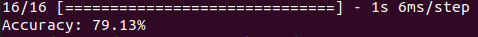

# Text Classification using Transformer Encoder

This repository contains custom implementation of a Transformer encoder model for the task of text classification. This model classifies text from financial data into three broad categories, viz.,
* POSITIVE
* NEGATIVE
* NEUTRAL

Please follow the below steps to train the model locally on your system.

### Dependencies:
* tensorflow==2.12.0
* pandas
* numpy
* scikit-learn
* tqdm

### Dataset
The data is already preprocessed and is present in `financial_data.csv` inside `data` folder. The dataset contains 4.8K samples from financial domain which are classified in the above three categories.

### Tokenization
Unlike popular LLMs, a word based tokenization strategy is applied in this project. Every word in the dataset is assigned a unique token. You can find the word to token mapping in `word_tokens.json` file.

__Be advise: Whitespaces and new lines are ignored in the tokenization process.__

### Training
Please run the following command to begin the training process,
```python
python train.py
```

### Stats
A testing accuracy of 79% was obtained on the testing dataset.
